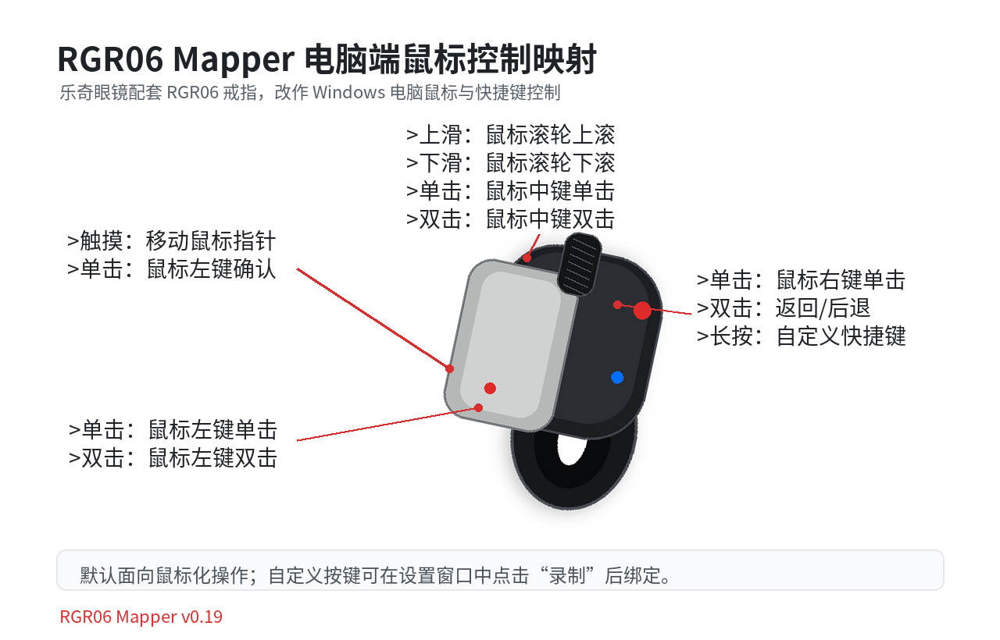

# RGR06 Mapper

RGR06 Mapper 是一个 Windows 本地映射程序，用于将乐奇眼镜配套的 Rokid/RGR06 蓝牙控制戒指改作电脑端鼠标和快捷键控制器。

## 适用场景

- 在 Windows 10/11 x64 电脑上使用 RGR06 戒指控制鼠标。
- 将原本面向乐奇眼镜的确认、返回、滑动等动作，改成电脑端鼠标滚轮、左键、右键和自定义快捷键。
- 需要一个开机自启动、常驻系统托盘、可暂停/恢复的本地映射工具。

## 下载安装

1. 在 GitHub Releases 下载 `RGR06-Mapper-Setup-v0.19.exe`。
2. 以管理员权限运行安装包。
3. 安装完成后重启电脑，让 Interception 驱动级输入过滤生效。
4. 启动 `RGR06 Mapper`，程序会常驻系统托盘；关闭设置窗口不会退出映射。

> 安装包已包含主程序、AutoHotInterception 依赖库和 Interception 驱动安装器，不需要单独安装 AutoHotkey。

## 默认映射

| RGR06 动作 | Windows 电脑操作 |
| --- | --- |
| 触摸面板移动 | 移动鼠标指针 |
| 触摸面板单击 | 鼠标左键确认 |
| 滚轮上滑 / 下滑 | 鼠标滚轮上滚 / 下滚 |
| 滚轮单击 | 鼠标中键单击 |
| 滚轮双击 | 鼠标中键双击 |
| 左侧键单击 | 鼠标左键单击 |
| 左侧键双击 | 鼠标左键双击 |
| 右侧键单击 | 鼠标右键单击 |
| 右侧键双击 | 返回 / 后退 |
| 右侧键长按 | 自定义快捷键 |

## 使用规范

- 请先完成 RGR06 与 Windows 的蓝牙配对，再启动本程序。
- 程序运行时会识别最近输入是否来自 RGR06，只有匹配到 RGR06 设备来源和对应键值时才执行映射。
- 设置窗口中可以为每个动作选择 Windows 功能；选择“自定义按键”时，点击该行“录制”并按下键盘按键或组合键完成绑定。
- 需要临时停用时，使用系统托盘菜单里的“暂停/继续映射”，不要直接结束驱动。
- 设置保存在 `%AppData%\RGR06 Mapper\settings.ini`。
- 如果鼠标或键盘行为异常，先从托盘暂停映射；如仍异常，再卸载程序并重启电脑。

## 注意事项

- Interception 是键盘/鼠标过滤驱动，安装和卸载都建议重启电脑。
- 企业安全软件或驱动管控策略可能会拦截驱动安装。
- 当前版本同一时间只按一只同型号 RGR06 设备进行映射。
- 触摸板切换功能不再作为默认映射；默认目标是把戒指改成电脑鼠标控制器。

## 源码结构

| 路径 | 说明 |
| --- | --- |
| `RGR06-Mapper.ahk` | 主程序源码，AutoHotkey v2 |
| `Lib/` | AutoHotInterception 运行依赖 |
| `installer/` | Inno Setup 安装包脚本和安装说明 |
| `assets/` | README 使用的功能说明图 |
| `tools/` | 测试、编译和辅助脚本 |

## 构建说明

1. 使用 Ahk2Exe 将 `RGR06-Mapper.ahk` 编译为 `dist\RGR06-Mapper-v0.19.exe`。
2. 使用 Inno Setup 打开 `installer\RGR06-Mapper.iss`。
3. 编译生成 `RGR06-Mapper-Setup-v0.19.exe`。

发布到 GitHub 时，源码进入仓库，安装包作为 Release 附件提供下载。
